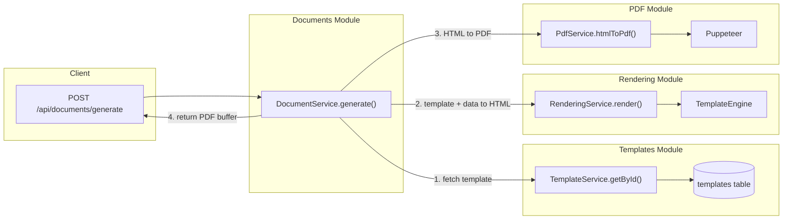

# Modular PDF Document Generation System

## Context

The existing codebase is a **Hono + Bun** API with **Drizzle ORM** (SQLite/Turso), flat `src/lib/` helpers, and `src/routes/` endpoints. There is no feature-based folder structure yet. The example document is a "Responsiva de equipo de computo" with dynamic fields: city, date, equipment description, serial number, person name, and signature blocks.

---

## Architecture Overview




---

## Folder Structure

New code lives under `src/features/` to separate it from existing flat `src/lib/` code. Each feature module owns its types, service, schema (if needed), and route (if exposed).

```
src/features/
  templates/
    templates.schema.ts      # Drizzle table definitions
    templates.types.ts       # TypeScript interfaces + Zod schemas
    templates.service.ts     # CRUD operations
    templates.routes.ts      # Hono routes for template management
    templates.service.test.ts

  rendering/
    rendering.types.ts       # RenderContext, RenderResult interfaces
    rendering.service.ts     # Template + data -> HTML
    rendering.engine.ts      # Variable interpolation engine (replaceable)
    rendering.service.test.ts

  pdf/
    pdf.types.ts             # PdfOptions, PdfResult interfaces
    pdf.service.ts           # HTML -> PDF via Puppeteer
    pdf.service.test.ts

  documents/
    documents.types.ts       # GenerateDocumentRequest, result types
    documents.service.ts     # Orchestrator: template -> render -> pdf
    documents.routes.ts      # POST /api/documents/generate
    documents.service.test.ts
```

Route registration in [src/routes/index.ts](src/routes/index.ts):

```typescript
import { templateRoutes } from '../features/templates/templates.routes'
import { documentRoutes } from '../features/documents/documents.routes'

routes.route('/templates', templateRoutes)
routes.route('/documents', documentRoutes)
```

---

## Module 1: Templates

### Database Schema (`templates.schema.ts`)

Two tables added to the existing Drizzle schema:

```typescript
export const documentTemplates = sqliteTable('document_templates', {
  id:          integer('id').primaryKey({ autoIncrement: true }),
  slug:        text('slug').notNull().unique(),         // e.g. "responsiva-equipo"
  name:        text('name').notNull(),                  // "Responsiva de Equipo de Computo"
  description: text('description'),
  htmlBody:    text('html_body').notNull(),              // HTML with {{variables}}
  cssStyles:   text('css_styles'),                       // scoped CSS
  variables:   text('variables', { mode: 'json' }).notNull(), // TemplateVariable[]
  pageConfig:  text('page_config', { mode: 'json' }),    // { format, margin, landscape }
  isActive:    integer('is_active', { mode: 'boolean' }).notNull().default(true),
  version:     integer('version').notNull().default(1),
  createdAt:   integer('created_at', { mode: 'timestamp' }).$defaultFn(() => new Date()),
  updatedAt:   integer('updated_at', { mode: 'timestamp' })
    .$defaultFn(() => new Date())
    .$onUpdateFn(() => new Date()),
})

export const generatedDocuments = sqliteTable('generated_documents', {
  id:         integer('id').primaryKey({ autoIncrement: true }),
  templateId: integer('template_id').notNull().references(() => documentTemplates.id),
  inputData:  text('input_data', { mode: 'json' }).notNull(),
  filename:   text('filename').notNull(),
  generatedBy: text('generated_by'),
  createdAt:  integer('created_at', { mode: 'timestamp' }).$defaultFn(() => new Date()),
})
```

### Types (`templates.types.ts`)

```typescript
export type VariableType = 'text' | 'date' | 'number' | 'image' | 'list'

export type TemplateVariable = {
  key: string           // "nombre", "fecha", "fotos"
  label: string         // "Nombre completo"
  type: VariableType
  required: boolean
  defaultValue?: string
}

export type PageConfig = {
  format?: 'letter' | 'a4' | 'legal'
  margin?: { top: string; right: string; bottom: string; left: string }
  landscape?: boolean
}
```

### Service (`templates.service.ts`)

Responsibilities:

- `create(input)` -- insert new template with slug uniqueness check
- `getById(id)` -- fetch by id
- `getBySlug(slug)` -- fetch by slug (primary lookup for generation)
- `list(filters?)` -- paginated list, filter by `isActive`
- `update(id, patch)` -- partial update, bumps `version`
- `delete(id)` -- soft-delete via `isActive = false` (or hard delete)
- `validateInputData(template, data)` -- check supplied data matches `variables` definition

### Routes (`templates.routes.ts`)

All behind `adminAuth` middleware:

- `GET /api/templates` -- list
- `GET /api/templates/:idOrSlug` -- get one
- `POST /api/templates` -- create
- `PATCH /api/templates/:id` -- update
- `DELETE /api/templates/:id` -- deactivate

---

## Module 2: Rendering

### Interface (`rendering.types.ts`)

```typescript
export type RenderContext = {
  htmlBody: string
  cssStyles?: string | null
  variables: TemplateVariable[]
  data: Record<string, unknown>
}

export type RenderResult = {
  html: string     // full HTML document ready for PDF conversion
}
```

### Engine (`rendering.engine.ts`)

A pure, stateless function that handles variable interpolation. This is the **replaceable** piece -- swap it for Handlebars, Mustache, or a custom DSL later without touching any other module.

Core logic:

- **Text variables**: simple `{{key}}` replacement with HTML-escaped values
- **Date variables**: `{{fecha}}` formatted via `Intl.DateTimeFormat` or passed pre-formatted
- **Image variables**: `{{fotos}}` replaced with `` tags (supports array of URLs/base64)
- **List variables**: `{{items}}` iterated into `<li>` elements
- **Conditional blocks**: `{{#if key}}...{{/if}}` (minimal, no full Handlebars dependency initially)

### Service (`rendering.service.ts`)

```typescript
export class RenderingService {
  render(ctx: RenderContext): RenderResult {
    const interpolated = templateEngine.interpolate(ctx.htmlBody, ctx.variables, ctx.data)
    const html = wrapInHtmlDocument(interpolated, ctx.cssStyles)
    return { html }
  }
}
```

`wrapInHtmlDocument` produces a full `<!DOCTYPE html>` page with embedded CSS, proper charset, and print-friendly defaults. This separation means the same service can return raw HTML for **real-time preview** in the future.

---

## Module 3: PDF

### Interface (`pdf.types.ts`)

```typescript
export type PdfOptions = {
  format?: 'letter' | 'a4' | 'legal'
  margin?: { top: string; right: string; bottom: string; left: string }
  landscape?: boolean
  headerTemplate?: string
  footerTemplate?: string
}

export type PdfResult = {
  buffer: Buffer
  pageCount: number
}
```

### Service (`pdf.service.ts`)

- Uses **Puppeteer** (via `puppeteer` or `puppeteer-core` + system Chromium)
- Manages a **singleton browser instance** with lazy initialization (avoids spawning a new browser per request)
- Exposes `htmlToPdf(html: string, options?: PdfOptions): Promise<PdfResult>`
- Handles graceful shutdown (closes browser on process exit)
- Future-extensible: swap Puppeteer for Playwright, or add image/DOCX output formats by implementing the same interface

```typescript
export class PdfService {
  private browser: Browser | null = null

  async htmlToPdf(html: string, options?: PdfOptions): Promise<PdfResult> {
    const browser = await this.getBrowser()
    const page = await browser.newPage()
    try {
      await page.setContent(html, { waitUntil: 'networkidle0' })
      const buffer = await page.pdf({
        format: options?.format ?? 'letter',
        margin: options?.margin ?? { top: '20mm', right: '15mm', bottom: '20mm', left: '15mm' },
        landscape: options?.landscape ?? false,
        printBackground: true,
      })
      return { buffer: Buffer.from(buffer), pageCount: 1 }
    } finally {
      await page.close()
    }
  }

  async shutdown(): Promise<void> { /* close browser */ }
}
```

**Dependency**: `puppeteer` added to root `package.json`.

---

## Module 4: Documents (Orchestrator)

### Interface (`documents.types.ts`)

```typescript
export type GenerateDocumentRequest = {
  templateSlug: string
  data: Record<string, unknown>
  outputFormat?: 'pdf' | 'html'     // extensible for future formats
  filename?: string
}

export type GenerateDocumentResult = {
  buffer: Buffer
  contentType: string
  filename: string
}
```

### Service (`documents.service.ts`)

The orchestrator. No business logic of its own -- pure coordination:

```typescript
export class DocumentService {
  constructor(
    private templateService: TemplateService,
    private renderingService: RenderingService,
    private pdfService: PdfService,
  ) {}

  async generate(req: GenerateDocumentRequest): Promise<GenerateDocumentResult> {
    // 1. Fetch template
    const template = await this.templateService.getBySlug(req.templateSlug)
    if (!template) throw new DocumentError('TEMPLATE_NOT_FOUND', ...)

    // 2. Validate input data against template variables
    this.templateService.validateInputData(template, req.data)

    // 3. Render HTML
    const { html } = this.renderingService.render({
      htmlBody: template.htmlBody,
      cssStyles: template.cssStyles,
      variables: template.variables,
      data: req.data,
    })

    // 4. If HTML-only requested, return early (for preview)
    if (req.outputFormat === 'html') {
      return { buffer: Buffer.from(html), contentType: 'text/html', filename: '...' }
    }

    // 5. Convert to PDF
    const { buffer } = await this.pdfService.htmlToPdf(html, template.pageConfig ?? undefined)

    // 6. Log generation (audit trail)
    await this.logGeneration(template.id, req.data, filename)

    return { buffer, contentType: 'application/pdf', filename }
  }
}
```

### Route (`documents.routes.ts`)

```
POST /api/documents/generate
  Body: { templateSlug, data, outputFormat?, filename? }
  Response: PDF binary (Content-Type: application/pdf) or HTML

POST /api/documents/preview
  Body: { templateSlug, data }
  Response: HTML string (for live preview in the editor)
```

---

## Seed Template: Responsiva de Equipo

Based on the example document, the first seeded template will be `responsiva-equipo` with these variables:


| Key             | Label                   | Type  | Required |
| --------------- | ----------------------- | ----- | -------- |
| `ciudad`        | Ciudad                  | text  | yes      |
| `fecha`         | Fecha de entrega        | date  | yes      |
| `objeto`        | Descripcion del equipo  | text  | yes      |
| `serie`         | Numero de serie         | text  | yes      |
| `nombre`        | Nombre del resguardante | text  | yes      |
| `titulo`        | Titulo profesional      | text  | no       |
| `nombreEntrega` | Nombre de quien entrega | text  | no       |
| `tituloEntrega` | Titulo de quien entrega | text  | no       |
| `fotos`         | Fotografias del equipo  | image | no       |


The HTML template will reproduce the Word document layout with proper print CSS, signature lines, and a photo grid when `fotos` is provided.

---

## Dependency Injection Pattern

Services are instantiated once and wired together in a single file to keep coupling explicit and testable:

```
src/features/container.ts
```

```typescript
import { TemplateService } from './templates/templates.service'
import { RenderingService } from './rendering/rendering.service'
import { PdfService } from './pdf/pdf.service'
import { DocumentService } from './documents/documents.service'

export const templateService = new TemplateService()
export const renderingService = new RenderingService()
export const pdfService = new PdfService()
export const documentService = new DocumentService(templateService, renderingService, pdfService)
```

Routes import from `container.ts`, never instantiate services directly.

---

## Key Design Decisions

- **Feature folders** (`src/features/`) introduced alongside existing `src/lib/` -- no refactoring of existing code needed
- **No Handlebars dependency initially** -- a custom lightweight engine handles `{{var}}`, `{{#if}}`, and `{{#each}}` patterns; swappable later
- **Puppeteer singleton** -- avoids cold-start penalty per request; gracefully shuts down
- `**outputFormat` field** -- returns HTML for preview or PDF for download, enabling a future template editor with live preview
- `**generatedDocuments` audit table** -- tracks every generation for compliance/history without coupling to the generation flow
- **Template versioning** -- `version` column increments on update; future: store version history in a separate table
- **Zod validation** at both route and service layers -- route validates request shape, `TemplateService.validateInputData` validates data against template variable definitions

---

## Migration Plan

A single Drizzle migration adds both `document_templates` and `generated_documents` tables. Generated via `bunx drizzle-kit generate` after updating the schema file.

---

## New Dependencies


| Package     | Purpose                         |
| ----------- | ------------------------------- |
| `puppeteer` | Headless Chrome for HTML-to-PDF |


No other external dependencies. The template engine is custom (< 100 lines).