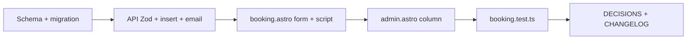

# Plan: Required budget field (booking)

**Status:** Ready to implement  
**Decision:** Budget is a **required** field using **preset ranges** (dropdown), stored as text enum values — matches existing patterns (`attendees`, `duration`) and supports future lead scoring without free-text noise.

---

## Scope

End-to-end: DB column, migration, API validation + insert + band email, public form, admin table, tests, `DECISIONS.md` + `CHANGELOG.md`.

---

## Storage shape

| DB column | Type   | Values |
|-----------|--------|--------|
| `budget`  | `text` | `menos_15k`, `15k_25k`, `25k_50k`, `50k_100k`, `mas_100k` |

- Column nullable in SQLite for **existing rows**; API + form require budget for **new** submissions.

---

## Implementation steps

### 1. Schema

**File:** [src/db/schema.ts](src/db/schema.ts)

Add to `bookings`:

`budget: text('budget')`

### 2. Migration

**File:** `drizzle/0005_budget_field.sql` (next sequential after `0004_booking_detail_fields.sql`)

```sql
ALTER TABLE `bookings` ADD `budget` text;
```

Same style as [drizzle/0004_booking_detail_fields.sql](drizzle/0004_booking_detail_fields.sql). Deploy applies via existing `scripts/run-migration.ts` sorted order.

### 3. API

**File:** [src/routes/booking.ts](src/routes/booking.ts)

- Extend `bookingSchema` with `budget`: required string, restricted to the five allowed values (e.g. `z.enum([...])` with Spanish `spanishErrorMap` messages as needed).
- Destructure `budget`, pass to `insert().values({ ... })`.
- Append to band notification `text` array, e.g. `Budget: ${budget}` (optional human-readable label map in code or raw slug — pick one and stay consistent in admin display).

### 4. Public form

**File:** [web/src/pages/booking.astro](web/src/pages/booking.astro)

- Add required `<select id="budget" name="budget">` with options:
  - Menos de $15,000 MXN → `menos_15k`
  - $15,000 – $25,000 MXN → `15k_25k`
  - $25,000 – $50,000 MXN → `25k_50k`
  - $50,000 – $100,000 MXN → `50k_100k`
  - Más de $100,000 MXN → `mas_100k`
- Placement: after **Tipo de evento** (or next logical block); keep `field-label` / `field-input field-select` classes.
- In the submit script, add `budget: fd.get('budget') || undefined` to the JSON body.

### 5. Admin UI

**File:** [web/src/pages/admin.astro](web/src/pages/admin.astro)

- Extend the local `bookings` type with `budget: string | null`.
- Add table header **Budget** and cell `{booking.budget ?? '-'}` (map slug → Spanish label in template or leave slug for v1).

### 6. Admin export

**File:** [src/routes/admin.ts](src/routes/admin.ts)

- If export uses full row `select()`, new column appears automatically once schema + DB match. Verify [src/lib/adminBookingExport.ts](src/lib/adminBookingExport.ts) if it whitelists fields; add `budget` if needed.

### 7. Tests

**File:** [src/routes/booking.test.ts](src/routes/booking.test.ts)

- **400** when required fields present but `budget` missing / invalid enum.
- **201** extended-fields test: include `budget` and assert `insertRow?.budget`.
- Keep existing tests green (`BOOKING_NOTIFICATION_EMAIL`, honeypot, Resend paths).

### 8. Documentation

- **[DECISIONS.md](DECISIONS.md):** Entry — budget stored as text enum ranges; alternatives (numeric, min/max) and why dropdown was chosen.
- **[CHANGELOG.md](CHANGELOG.md):** `[Unreleased]` — Added required booking budget (ranges), migration, admin column.

---

## Execution order



---

## Files touched (checklist)

- [ ] [src/db/schema.ts](src/db/schema.ts)
- [ ] `drizzle/0005_budget_field.sql`
- [ ] [src/routes/booking.ts](src/routes/booking.ts)
- [ ] [web/src/pages/booking.astro](web/src/pages/booking.astro)
- [ ] [web/src/pages/admin.astro](web/src/pages/admin.astro)
- [ ] [src/routes/booking.test.ts](src/routes/booking.test.ts)
- [ ] [src/lib/adminBookingExport.ts](src/lib/adminBookingExport.ts) (only if export whitelists columns)
- [ ] [DECISIONS.md](DECISIONS.md)
- [ ] [CHANGELOG.md](CHANGELOG.md)

---

## Related

- [TODOS.md](TODOS.md) — **Booking — Required budget field (DB + API + form + admin)**
- Follow-ups after this ships: admin sort by budget, lead score + priority (depends on parseable budget ranges).
